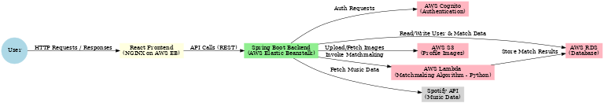

# 🎵 Vibrations — Music-Based Matchmaking (Hub Repo)

Vibrations is a full-stack web application that connects people based on their **music preferences**.  
This is my **personal hub repository**: it summarizes the project, links all the team repositories, and highlights **my work on the Matchmaking Algorithm (AWS Lambda) and deployment**, along with **active contributions to the React frontend and Spotify integration**.

> Full technical details and documentation are in the [/docs](./docs) folder.

---

## 🚀 What the app does
- Users create a profile with:
  - Profile picture
  - Short bio
  - Top songs, artists, and genres
- Connects to **Spotify API** to fetch real listening data (or allows manual entry)
- Uses **geolocation** + user-chosen distance radius
- Finds nearby matches with similar music taste via a custom matchmaking algorithm
- Allows users to “like” profiles and connect when there’s mutual interest  
*(Supports both platonic and romantic connections)*

---

## 🧱 Architecture (High-Level)



**Key components:**
- **Frontend:** React app served via **NGINX** on AWS Elastic Beanstalk  
- **Backend:** Spring Boot REST API on AWS Elastic Beanstalk  
- **Matchmaking:** Python algorithm deployed on **AWS Lambda**, invoked by backend  
- **Auth & Storage:** AWS Cognito (auth), AWS S3 (images), AWS RDS (PostgreSQL/MySQL)  
- **External API:** Spotify Web API for music data retrieval

---

## 💡 My Role

**Main focus:**
- Designed and implemented the **Matchmaking Algorithm**  
  - Scored matches based on overlap in artists, songs, and genres  
  - Applied geolocation filtering using haversine distance formula  
  - Tunable weighting for different similarity metrics
- **Deployed algorithm on AWS Lambda**  
  - Packaged Python handler, configured IAM roles and environment variables  
  - Integrated Lambda invocation into Spring Boot backend

**Active contributions:**
- **React Frontend Development**  
  - Built match display components and UI elements for results  
  - Integrated frontend with backend matchmaking API  
  - Worked on CORS configuration and NGINX deployment
- **Spotify API Integration**  
  - Helped implement Spotify OAuth flow  
  - Assisted in fetching and mapping user music data into profile schema

---

## 🔗 Related Team Repositories (VTCS5704-Team1)
- [Frontend (React)](https://github.com/VTCS5704-Team1/vibrations-front-end)  
- [Backend (Spring Boot)](https://github.com/VTCS5704-Team1/vibrations-back-end)  
- [Matchmaking (AWS Lambda)](https://github.com/VTCS5704-Team1/vibrations-matchmaking)  
- [NGINX Config](https://github.com/VTCS5704-Team1/nginx)  
- [Team Organization Home](https://github.com/VTCS5704-Team1)  

> Note: Cloud instances (Elastic Beanstalk) may be offline now to avoid costs.  
> Local run instructions are in the frontend/backend READMEs.

---

## 🧮 Matchmaking Algorithm (AWS Lambda) — Example Interface

**Sample Input**
```json
{
  "user_id": "123",
  "radius_km": 25,
  "music_profile": {
    "top_artists": ["Taylor Swift", "Drake", "Arijit Singh"],
    "top_songs": ["Song A", "Song B"],
    "top_genres": ["pop", "indie"]
  },
  "location": {"lat": 38.8048, "lon": -77.0469}
}
**Sample Output**
```json
{
  "user_id": "123",
  "matches": [
    {
      "match_user_id": "987",
      "score": 0.83,
      "overlap": { "artists": 2, "songs": 1, "genres": 1 },
      "distance_km": 6.4
    }
  ]
}
---
## 📚 Documentation
- **[Vibrations Presentation (PDF)](./docs/Vibrations%20Presentation.pdf)**  
  - Project overview, motivation, and demo screenshots.
- **[Repository Structure & Links (PDF)](./docs/Vibrations%20Repository.pdf)**  
  - Mapping of all repositories and how they connect.
- **[Final Project Report (PDF)](./docs/Vibrations_Final_Project_report.pdf)**  
  - Detailed architecture, implementation details, challenges, and future scope.

---

## 🗺 Future Work
From the final report:
- **Chat/messaging feature**  
  - Enable real-time conversations between matched users.
- **UI redesign**  
  - Improve usability, responsiveness, and visual appeal.
- **Stronger security (CIS-aligned NGINX)**  
  - Harden NGINX configurations for production readiness.
- **Custom domains & HTTPS**  
  - Replace Elastic Beanstalk default domains with branded, secure ones.
- **Two-factor authentication**  
  - Add an extra layer of login security.
- **Email validation**  
  - Verify user email addresses before activation.
- **Persistent “likes” and profile editing**  
  - Allow users to save matches and update profiles post-registration.
- **Mobile app version**  
  - Develop native mobile apps for iOS and Android.
- **Spotify app upgrade to extended quota mode**  
  - Expand Spotify API access beyond development mode for more users.
